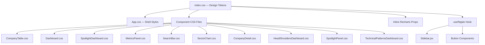
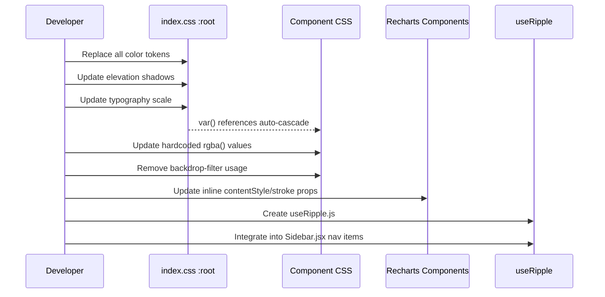

# Design Document: Material UI Overhaul

## Overview

This design covers the complete visual overhaul of the Portfolio Intelligence web application, replacing the warm brown palette with a Google-inspired Material Design aesthetic. The implementation is purely CSS-driven (token replacement + component restyling) with one small React hook addition (`useRipple`). No structural HTML changes are required — the existing class names and component hierarchy remain intact.

The approach is file-by-file: update `index.css` tokens first, then cascade changes through component CSS files, add the ripple hook, and update chart theme props inline.

## Architecture




## Sequence Diagram: Token Cascade



## Components and Interfaces

### Component 1: Design Token System (`analysis/web/src/index.css`)

**Purpose**: Single source of truth for all visual values. Changing tokens here cascades to every component that uses `var()` references.

**Interface** — Complete `:root` token replacement:

```css
:root {
  /* ── Dark Neutral Palette ── */
  --bg-deepest:    #0d0d1a;
  --bg-primary:    #121212;
  --bg-secondary:  #1a1a2e;
  --bg-tertiary:   #1e1e2e;
  --bg-card:       #252536;
  --bg-card-hover: #2d2d3f;
  --bg-sidebar:    #0d0d1a;

  /* ── Google Accent Colors ── */
  --accent-primary:        #4285F4;  /* Google Blue — interactive default */
  --accent-primary-bright: #5a9cf6;  /* Blue hover/bright variant */
  --accent-blue:           #4285F4;
  --accent-blue-bright:    #5a9cf6;
  --accent-red:            #DB4437;
  --accent-green:          #0F9D58;
  --accent-yellow:         #F4B400;
  --accent-purple:         #AB47BC;
  --accent-cyan:           #00BCD4;
  --accent-orange:         #FF7043;
  --accent-pink:           #E91E63;

  /* Dim variants for tinted backgrounds */
  --accent-green-dim:  rgba(15, 157, 88, 0.15);
  --accent-red-dim:    rgba(219, 68, 55, 0.15);
  --accent-blue-dim:   rgba(66, 133, 244, 0.15);
  --accent-yellow-dim: rgba(244, 180, 0, 0.15);

  /* ── Text ── */
  --text-primary:   #E8EAED;
  --text-secondary: #9AA0A6;
  --text-muted:     #5F6368;
  --text-inverse:   #121212;

  /* ── Borders ── */
  --border-color:       rgba(255, 255, 255, 0.06);
  --border-color-hover: rgba(255, 255, 255, 0.12);
  --border-sidebar:     rgba(255, 255, 255, 0.04);

  /* ── Elevation (Material Design) ── */
  --elevation-0: none;
  --elevation-1: 0 1px 3px rgba(0,0,0,0.24), 0 1px 2px rgba(0,0,0,0.36);
  --elevation-2: 0 3px 6px rgba(0,0,0,0.28), 0 3px 6px rgba(0,0,0,0.34);
  --elevation-3: 0 10px 20px rgba(0,0,0,0.30), 0 6px 6px rgba(0,0,0,0.34);
  --elevation-4: 0 14px 28px rgba(0,0,0,0.36), 0 10px 10px rgba(0,0,0,0.30);
  --elevation-5: 0 19px 38px rgba(0,0,0,0.42), 0 15px 12px rgba(0,0,0,0.30);
```

```css
  /* ── Layout (unchanged) ── */
  --sidebar-width:     220px;
  --sidebar-collapsed: 64px;
  --topbar-height:     56px;

  /* ── Spacing (unchanged) ── */
  --spacing-xs:  0.25rem;
  --spacing-sm:  0.5rem;
  --spacing-md:  1rem;
  --spacing-lg:  1.5rem;
  --spacing-xl:  2rem;
  --spacing-2xl: 3rem;

  /* ── Border Radius ── */
  --radius-sm:   4px;
  --radius-md:   8px;
  --radius-lg:   12px;
  --radius-xl:   20px;
  --radius-pill: 999px;

  /* ── Transitions (unchanged) ── */
  --transition-fast:   0.15s ease;
  --transition-normal: 0.25s ease;
  --transition-slow:   0.4s ease;

  /* ── Sector Colors (high-contrast against #1e1e2e) ── */
  --sector-it:             #4285F4;
  --sector-healthcare:     #0F9D58;
  --sector-financials:     #F4B400;
  --sector-discretionary:  #E91E63;
  --sector-industrials:    #AB47BC;
  --sector-staples:        #00BCD4;
  --sector-energy:         #DB4437;
  --sector-utilities:      #26A69A;
  --sector-realestate:     #7E57C2;
  --sector-materials:      #FF7043;
  --sector-communication:  #BA68C8;

  /* ── Typography Scale ── */
  --type-display-size:     2rem;
  --type-display-weight:   700;
  --type-display-leading:  1.2;
  --type-display-tracking: -0.02em;

  --type-headline-size:     1.5rem;
  --type-headline-weight:   600;
  --type-headline-leading:  1.2;
  --type-headline-tracking: -0.01em;

  --type-title-size:     1.125rem;
  --type-title-weight:   600;
  --type-title-leading:  1.4;
  --type-title-tracking: 0em;

  --type-body-size:     0.875rem;
  --type-body-weight:   400;
  --type-body-leading:  1.5;
  --type-body-tracking: 0em;

  --type-label-size:     0.75rem;
  --type-label-weight:   500;
  --type-label-leading:  1.4;
  --type-label-tracking: 0.04em;

  /* ── Chart Colors ── */
  --chart-series-1: #4285F4;
  --chart-series-2: #DB4437;
  --chart-series-3: #0F9D58;
  --chart-series-4: #F4B400;
  --chart-series-5: #AB47BC;
  --chart-series-6: #00BCD4;
  --chart-series-7: #FF7043;
  --chart-series-8: #E91E63;
  --chart-grid:     rgba(255, 255, 255, 0.06);
}
```


### Component 2: Elevation System

**Purpose**: Communicate visual hierarchy through shadow depth + surface lightening.

**Mapping**:

| Elevation Level | Surface Color | Box-Shadow | Used By |
|---|---|---|---|
| 0 | `--bg-primary` (#121212) | none | Flat backgrounds, disabled elements |
| 1 | `--bg-tertiary` (#1e1e2e) | `--elevation-1` | Cards, stat-tiles, table-container, alerts |
| 2 | `--bg-card` (#252536) | `--elevation-2` | Primary buttons, sidebar, raised cards on hover |
| 3 | `--bg-card-hover` (#2d2d3f) | `--elevation-3` | Dropdowns, tooltips, popovers |
| 4 | `--bg-card-hover` (#2d2d3f) | `--elevation-4` | Modals, dialogs |
| 5 | `--bg-card-hover` (#2d2d3f) | `--elevation-5` | Reserved (max depth) |

**Hover behavior**: Interactive surfaces transition from their resting elevation to +1 level within 200ms ease.

```css
/* Card elevation pattern */
.glass-card {
  background: var(--bg-tertiary);
  border: 1px solid var(--border-color);
  border-radius: var(--radius-lg);
  padding: var(--spacing-lg);
  box-shadow: var(--elevation-1);
  transition: background 0.2s ease, box-shadow 0.2s ease;
}

.glass-card:hover {
  background: var(--bg-card);
  box-shadow: var(--elevation-2);
  border-color: var(--border-color-hover);
}
```

### Component 3: Ripple Effect (`analysis/web/src/hooks/useRipple.js`)

**Purpose**: Material Design interaction feedback on buttons and nav items.

**Interface**:

```javascript
import { useCallback } from 'react';

export function useRipple() {
  const createRipple = useCallback((event) => {
    const element = event.currentTarget;
    const rect = element.getBoundingClientRect();
    const size = Math.max(rect.width, rect.height) * 2;
    const x = event.clientX - rect.left - size / 2;
    const y = event.clientY - rect.top - size / 2;

    const ripple = document.createElement('span');
    ripple.className = 'ripple-effect';
    ripple.style.width = ripple.style.height = `${size}px`;
    ripple.style.left = `${x}px`;
    ripple.style.top = `${y}px`;

    element.appendChild(ripple);
    ripple.addEventListener('animationend', () => ripple.remove());
  }, []);

  return createRipple;
}
```


**CSS for ripple animation** (added to `index.css`):

```css
/* ── Ripple Effect ── */
.ripple-effect {
  position: absolute;
  border-radius: 50%;
  background: rgba(255, 255, 255, 0.2);
  transform: scale(0);
  animation: ripple-animation 400ms ease-out forwards;
  pointer-events: none;
}

@keyframes ripple-animation {
  0% {
    transform: scale(0);
    opacity: 0.2;
  }
  100% {
    transform: scale(1);
    opacity: 0;
  }
}
```

**Integration in Sidebar.jsx**:

```javascript
import { useRipple } from '../hooks/useRipple';

export default function Sidebar({ currentPage, onNavigate, portfolioConnected }) {
  const createRipple = useRipple();

  // In nav item buttons:
  <button
    className={`nav-item ${currentPage === item.id ? 'active' : ''}`}
    onClick={(e) => { createRipple(e); onNavigate(item.id); }}
  >
```

**Requirements**: All elements using ripple MUST have `position: relative` and `overflow: hidden` in their CSS.

### Component 4: Button Primitives

**Restyled variants** (in `index.css`):

```css
.btn {
  position: relative;
  overflow: hidden; /* contains ripple */
  min-height: 36px;
  border-radius: var(--radius-md);
  font-size: 0.825rem;
  font-weight: 500;
  transition: background 0.2s ease, box-shadow 0.2s ease;
}

.btn-primary {
  background: var(--accent-blue);
  color: #ffffff;
  box-shadow: var(--elevation-2);
}
.btn-primary:hover:not(:disabled) {
  background: var(--accent-blue-bright);
  box-shadow: var(--elevation-3);
}

.btn-secondary {
  background: transparent;
  color: var(--accent-blue);
  border: 1px solid var(--accent-blue);
}
.btn-secondary:hover:not(:disabled) {
  background: rgba(66, 133, 244, 0.08);
  box-shadow: var(--elevation-1);
}

.btn-ghost {
  background: transparent;
  color: var(--accent-blue);
  border: none;
}
.btn-ghost:hover:not(:disabled) {
  background: rgba(66, 133, 244, 0.08);
}

.btn-danger {
  background: var(--accent-red);
  color: #ffffff;
  box-shadow: var(--elevation-2);
}
.btn-danger:hover:not(:disabled) {
  background: #e25549;
  box-shadow: var(--elevation-3);
}

.btn:disabled {
  opacity: 0.38;
  box-shadow: var(--elevation-0);
  cursor: not-allowed;
}

/* Focus-visible ring */
.btn:focus-visible {
  outline: 2px solid var(--accent-blue);
  outline-offset: 2px;
}
```


### Component 5: Input and Form Styles

```css
.input, .select {
  background: var(--bg-tertiary);
  border: 1px solid rgba(255, 255, 255, 0.12);
  border-radius: var(--radius-md);
  color: var(--text-primary);
  min-height: 36px;
  padding: var(--spacing-sm) 12px;
  transition: border-color 0.2s ease, box-shadow 0.2s ease;
}

.input:focus, .select:focus {
  outline: none;
  border-color: var(--accent-blue);
  box-shadow: 0 0 0 3px rgba(66, 133, 244, 0.2);
}

.input::placeholder { color: var(--text-muted); }

.input:disabled, .select:disabled {
  opacity: 0.38;
  cursor: not-allowed;
}

/* Error state */
.input.error {
  border-color: var(--accent-red);
}
.input.error:focus {
  box-shadow: 0 0 0 3px rgba(219, 68, 55, 0.2);
}
```

### Component 6: Table Styles

```css
.table-container {
  overflow: hidden;
  overflow-x: auto;
  border-radius: var(--radius-lg);
  border: 1px solid var(--border-color);
  box-shadow: var(--elevation-1);
  background: var(--bg-tertiary);
}

th {
  background: var(--bg-secondary);  /* #1a1a2e — one level darker */
  color: var(--text-muted);
  font-size: var(--type-label-size);
  font-weight: var(--type-label-weight);
  text-transform: uppercase;
  letter-spacing: var(--type-label-tracking);
  padding: 12px 16px;
  border-bottom: 1px solid var(--border-color);
}

th:hover { color: var(--accent-blue); }
th.sorted { color: var(--accent-blue); }

td {
  padding: 12px 16px;
  border-bottom: 1px solid var(--border-color);
  font-size: 0.825rem;
}

tr:hover td {
  background: rgba(66, 133, 244, 0.08);
}
```

### Component 7: Badge Styles

```css
.badge {
  display: inline-flex;
  align-items: center;
  gap: 4px;
  padding: 2px 10px;
  border-radius: var(--radius-pill);
  font-size: 0.7rem;
  font-weight: 600;
}

.badge-blue   { background: rgba(66, 133, 244, 0.15);  color: #8ab4f8; }
.badge-green  { background: rgba(15, 157, 88, 0.15);   color: #81c995; }
.badge-red    { background: rgba(219, 68, 55, 0.15);   color: #f28b82; }
.badge-yellow { background: rgba(244, 180, 0, 0.15);   color: #fdd663; }
.badge-purple { background: rgba(171, 71, 188, 0.15);  color: #d7aefb; }
.badge-cyan   { background: rgba(0, 188, 212, 0.15);   color: #78d9ec; }
.badge-gray   { background: rgba(154, 160, 166, 0.12); color: #9AA0A6; }

/* P&L values */
.value-positive { color: var(--accent-green); }
.value-negative { color: var(--accent-red); }
.value-neutral  { color: var(--text-secondary); }

.pnl-positive { color: var(--accent-green); font-family: 'JetBrains Mono', monospace; }
.pnl-negative { color: var(--accent-red);   font-family: 'JetBrains Mono', monospace; }
```


### Component 8: Tab Styles

```css
.tabs {
  display: flex;
  gap: 2px;
  background: var(--bg-secondary);
  border-radius: var(--radius-lg);
  padding: 4px;
}

.tab-btn {
  flex: 1;
  padding: var(--spacing-sm) var(--spacing-md);
  min-height: 48px;
  border: none;
  border-radius: var(--radius-md);
  background: transparent;
  color: var(--text-muted);
  font-size: var(--type-label-size);
  font-weight: 500;
  cursor: pointer;
  transition: all 0.2s ease;
  position: relative;
}

.tab-btn:hover {
  background: rgba(255, 255, 255, 0.05);
  color: var(--text-primary);
}

.tab-btn.active {
  background: var(--bg-tertiary);
  color: var(--accent-blue);
  box-shadow: var(--elevation-1);
  border-bottom: 2px solid var(--accent-blue);
}
```

### Component 9: Alert Styles

```css
.alert {
  display: flex;
  align-items: flex-start;
  gap: var(--spacing-sm);
  padding: 12px 16px;
  border-radius: var(--radius-md);
  font-size: 0.825rem;
  box-shadow: var(--elevation-1);
}

.alert-success {
  background: rgba(15, 157, 88, 0.1);
  border: none;
  border-left: 3px solid var(--accent-green);
  color: var(--accent-green);
}

.alert-error {
  background: rgba(219, 68, 55, 0.1);
  border: none;
  border-left: 3px solid var(--accent-red);
  color: var(--accent-red);
}

.alert-info {
  background: rgba(66, 133, 244, 0.1);
  border: none;
  border-left: 3px solid var(--accent-blue);
  color: var(--accent-blue);
}

.alert-warning {
  background: rgba(244, 180, 0, 0.1);
  border: none;
  border-left: 3px solid var(--accent-yellow);
  color: var(--accent-yellow);
}
```

### Component 10: Sidebar Navigation

```css
.sidebar {
  background: var(--bg-sidebar);  /* #0d0d1a */
  box-shadow: 2px 0 8px rgba(0, 0, 0, 0.3);  /* right-side elevation-2 */
}

.nav-item {
  position: relative;
  overflow: hidden;  /* ripple containment */
  border-radius: var(--radius-md);
  transition: background 0.2s ease, color 0.2s ease;
}

.nav-item:hover {
  background: rgba(255, 255, 255, 0.05);
  color: var(--text-primary);
}

.nav-item.active {
  background: rgba(66, 133, 244, 0.12);
  color: var(--accent-blue);
  border-left: 3px solid var(--accent-blue);
  padding-left: calc(var(--spacing-sm) - 3px);
  border-radius: var(--radius-md);
}

.nav-item.active:hover {
  background: rgba(66, 133, 244, 0.12);  /* maintain active style */
}
```


### Component 11: Scrollbar Styles

```css
::-webkit-scrollbar { width: 8px; height: 8px; }
::-webkit-scrollbar-track { background: var(--bg-deepest); }
::-webkit-scrollbar-thumb {
  background: rgba(255, 255, 255, 0.15);
  border-radius: 4px;
  transition: background 0.15s ease;
}
::-webkit-scrollbar-thumb:hover { background: rgba(255, 255, 255, 0.3); }
```

### Component 12: Spinner

```css
.spinner {
  border: 2px solid rgba(255, 255, 255, 0.1);
  border-top-color: var(--accent-blue);
  border-radius: 50%;
  animation: spin 0.8s linear infinite;
}
```

### Component 13: Focus-Visible Global Rule

```css
:focus-visible {
  outline: 2px solid var(--accent-blue);
  outline-offset: 2px;
}
```

## Data Models

### Token Taxonomy

```typescript
interface DesignTokens {
  // Backgrounds — graduated dark neutral scale
  bgDeepest:   '#0d0d1a';  // Scrollbar track, sidebar
  bgPrimary:   '#121212';  // Page background
  bgSecondary: '#1a1a2e';  // Table headers, tab containers
  bgTertiary:  '#1e1e2e';  // Cards at rest (elevation 1)
  bgCard:      '#252536';  // Cards on hover (elevation 2)
  bgCardHover: '#2d2d3f';  // Tooltips, dropdowns (elevation 3)

  // Accents — Google palette
  accentBlue:   '#4285F4';
  accentRed:    '#DB4437';
  accentGreen:  '#0F9D58';
  accentYellow: '#F4B400';

  // Text
  textPrimary:   '#E8EAED';  // 13.5:1 vs #121212
  textSecondary: '#9AA0A6';  //  7.8:1 vs #121212
  textMuted:     '#5F6368';  //  4.6:1 vs #121212 (meets AA for large text)
}
```

### Chart Theme Object

Used inline in Recharts components:

```javascript
const CHART_THEME = {
  tooltip: {
    contentStyle: {
      background: '#1e1e2e',
      border: '1px solid rgba(255,255,255,0.06)',
      borderRadius: 8,
      boxShadow: '0 10px 20px rgba(0,0,0,0.30), 0 6px 6px rgba(0,0,0,0.34)',
    },
    labelStyle: { color: '#9AA0A6' },
    itemStyle: { color: '#E8EAED' },
  },
  grid: { stroke: 'rgba(255,255,255,0.06)', strokeDasharray: '3 3' },
  axis: { stroke: '#5F6368', tick: { fill: '#5F6368', fontSize: 11 } },
  series: ['#4285F4', '#DB4437', '#0F9D58', '#F4B400', '#AB47BC', '#00BCD4', '#FF7043', '#E91E63'],
};
```


## File-by-File Change Strategy

### Phase 1: Token Foundation

| File | Changes |
|------|---------|
| `analysis/web/src/index.css` | Replace entire `:root` block with new tokens. Update all hardcoded `rgba(212, 165, 116, ...)` references to `rgba(255, 255, 255, ...)` or `rgba(66, 133, 244, ...)`. Remove any `backdrop-filter`. Add ripple CSS. Add `:focus-visible` rule. Update scrollbar styles. |

### Phase 2: Shell & Layout

| File | Changes |
|------|---------|
| `analysis/web/src/App.css` | Remove `backdrop-filter: blur(12px)` from `.app-header`. Replace gradient backgrounds with solid `var(--accent-blue)`. Update `.btn-refresh` from purple gradient to solid blue. Replace `var(--accent-cyan)` references with `var(--accent-blue)`. |

### Phase 3: Component CSS Files

| File | Key Changes |
|------|-------------|
| `analysis/web/src/components/CompanyTable.css` | Replace `rgba(212, 165, 116, 0.06)` hover with `rgba(66, 133, 244, 0.08)`. Update `.ticker-badge` from cyan to blue. Update `.btn-filter.active` to use `var(--accent-blue)`. |
| `analysis/web/src/components/Dashboard.css` | Remove `var(--gradient-card)` pseudo-element. Replace hover transforms with elevation transitions. |
| `analysis/web/src/components/SpotlightDashboard.css` | Replace `rgba(212, 165, 116, 0.06)` hover with `rgba(66, 133, 244, 0.08)`. Update `.spotlight-dashboard-count` from `--accent-primary` (brown) to `--accent-blue`. Update `.sort-icon.active` color. |
| `analysis/web/src/components/SpotlightPanel.css` | Update any warm-toned hover/active states to blue-tinted. |
| `analysis/web/src/components/MetricsPanel.css` | Update `.ticker` color from cyan to blue. Update hover backgrounds. |
| `analysis/web/src/components/SearchBar.css` | Already uses `--accent-blue` for focus — minimal changes. Verify `box-shadow` focus ring uses new blue value. |
| `analysis/web/src/components/SectorChart.css` | Update tooltip `contentStyle` references. |
| `analysis/web/src/components/CompanyDetail.css` | Replace warm-toned accents with Google palette equivalents. |
| `analysis/web/src/components/HeadShouldersDashboard.css` | Update any warm-toned references. |
| `analysis/web/src/components/TechnicalPatternsDashboard.css` | Update any warm-toned references. |

### Phase 4: React Components (Inline Styles)

| File | Changes |
|------|---------|
| `analysis/web/src/components/Sidebar.jsx` | Import and integrate `useRipple` hook. Add `onClick` ripple trigger to nav items. |
| `analysis/web/src/components/SectorChart.jsx` | Update Recharts `Tooltip contentStyle` to use Material surface. Update `CartesianGrid stroke`. |
| `analysis/web/src/components/FinancialTrendsChart.jsx` | Update `ChartTooltip` inline styles to use `#1e1e2e` background. Update `CartesianGrid stroke` from `rgba(45,126,247,0.08)` to `rgba(255,255,255,0.06)`. |
| `analysis/web/src/components/AllocationChart.jsx` | Same tooltip/grid updates as above. |

### Phase 5: New File

| File | Purpose |
|------|---------|
| `analysis/web/src/hooks/useRipple.js` | New file — the `useRipple` hook (~25 lines). |

## Responsive Behavior Preservation

The overhaul is purely cosmetic — no layout structure changes:

1. **Sidebar**: Fixed at 220px, same `margin-left` on `.main-content`. No responsive breakpoint changes.
2. **Grid utilities**: `.grid-2`, `.grid-3`, `.grid-4` remain unchanged. Their `@media (max-width: 768px)` collapse rules are preserved.
3. **Page content**: `max-width: 1600px` with auto margins stays.
4. **Component breakpoints**: All existing `@media` queries in component CSS files are left untouched — only color/shadow values within them change.
5. **Topbar height** and **sidebar collapsed width** tokens remain at their current values.

## Error Handling

### Graceful Degradation

- If `backdrop-filter` removal causes any visual regression, the solid surface colors provide equivalent visual separation via elevation shadows.
- The ripple hook uses `animationend` cleanup — if the animation is interrupted, the span is garbage-collected on next click.
- All `var()` references fall back gracefully since we're replacing values, not removing properties.

### Edge Cases

- **Concurrent ripples**: Multiple rapid clicks create overlapping ripple spans, each with independent 400ms lifecycle. No debouncing needed.
- **Disabled elements**: `pointer-events: none` on disabled buttons prevents ripple creation.
- **High contrast**: All text tokens meet WCAG AA (4.5:1) against their expected surface. Google accent colors meet 3:1 for UI components against #1e1e2e.


## Testing Strategy

### Visual Verification

Since this is a CSS-only overhaul (no logic changes), testing is primarily visual:

1. **Token audit**: Grep for any remaining warm-brown hex values (`#2a1f1e`, `#3b2b29`, `#4d3937`, `#5a4442`, `#6b4f4c`, `#241a19`, `#d4a574`, `#e8c49a`) — none should remain.
2. **Computed style check**: No element should have `backdrop-filter` other than `none`.
3. **Contrast verification**: Spot-check text colors against surfaces using browser DevTools contrast checker.
4. **Ripple test**: Click buttons and nav items — ripple should originate from click point and fade within 400ms.

### Property-Based Testing Approach

**Property Test Library**: Not applicable — this is a pure CSS/visual overhaul with no testable business logic functions. The single JS addition (`useRipple`) is a 10-line DOM manipulation hook that is best verified through manual interaction testing.

### Build Verification

- `npm run build` must complete without errors after all changes.
- No new dependencies are introduced (the hook uses only React's `useCallback`).

## Performance Considerations

- **No performance regression**: Replacing `backdrop-filter: blur()` with solid backgrounds is a performance improvement (blur is GPU-expensive).
- **Ripple DOM nodes**: Each ripple creates a temporary `<span>` that self-removes after 400ms. At worst, rapid clicking creates ~5 concurrent spans — negligible.
- **Transition performance**: All transitions use `transform`, `opacity`, `background-color`, and `box-shadow` — all GPU-compositable or cheap to repaint.

## Dependencies

- **No new npm dependencies**. The hook uses React's built-in `useCallback`.
- **Google Fonts**: Already imported (Inter + JetBrains Mono) — no change needed.
- **Recharts**: Already installed — only inline prop values change.

## Correctness Properties

*A property is a characteristic or behavior that should hold true across all valid executions of a system — essentially, a formal statement about what the system should do. Properties serve as the bridge between human-readable specifications and machine-verifiable correctness guarantees.*

### Property 1: No Warm Brown Tokens Remain

*For any* CSS file in `analysis/web/src/`, no computed or declared color value shall have an HSL hue between 0° and 50° (or 330°–360°) at saturation above 10%. A grep for the old hex values (`#2a1f1e`, `#3b2b29`, `#4d3937`, `#5a4442`, `#6b4f4c`, `#241a19`, `#d4a574`, `#e8c49a`) must return zero matches.

**Validates: Requirements 1.9**

### Property 2: Elevation Monotonicity

*For any* two elevation levels L1 < L2, the box-shadow blur radius and vertical offset of L2 must be strictly greater than those of L1. The surface background color of L2 must be perceptually lighter (higher HSL lightness) than L1.

**Validates: Requirements 2.1, 2.2**

### Property 3: Ripple Containment

*For any* click event on an element with the ripple hook attached, the ripple `<span>` must be fully contained within the element's bounding box (ensured by `overflow: hidden` on the parent) and must be removed from the DOM within 500ms of creation.

**Validates: Requirements 4.1, 4.7**

### Property 4: WCAG AA Contrast Compliance

*For any* text token rendered against its expected surface background, the contrast ratio must be ≥ 4.5:1 for normal text (< 18.66px bold or < 24px regular) and ≥ 3:1 for large text. Specifically: #E8EAED on #121212 = 13.5:1 ✓, #9AA0A6 on #121212 = 7.8:1 ✓, #5F6368 on #121212 = 4.6:1 ✓ (large text only).

**Validates: Requirements 1.7, 1.10, 3.6, 10.3**

### Property 5: No Backdrop-Filter Usage

*For any* element in the rendered application, the computed `backdrop-filter` CSS property must equal `none`. No glassmorphism effects shall remain after the overhaul.

**Validates: Requirements 2.7, 5.4**

### Property 6: Responsive Layout Preservation

*For any* viewport width, the grid utility classes (`.grid-2`, `.grid-3`, `.grid-4`) must produce the same column count as before the overhaul. At viewport ≤ 768px, all grids must collapse to single-column. The sidebar width must remain 220px and main content `margin-left` must equal the sidebar width.

**Validates: Requirements 15.1, 15.2, 15.3, 15.5**

### Property 7: Hover Elevation Transition

*For any* interactive Material Surface (cards, buttons, nav items), hovering must increase the elevation by exactly one level, and the transition duration must be between 150ms and 250ms.

**Validates: Requirements 2.6, 5.2, 6.4**

### Property 8: Focus-Visible Ring Consistency

*For any* interactive element receiving keyboard focus (`:focus-visible`), a 2px solid outline in Google Blue (#4285F4) offset by 2px must be displayed.

**Validates: Requirements 4.6**
