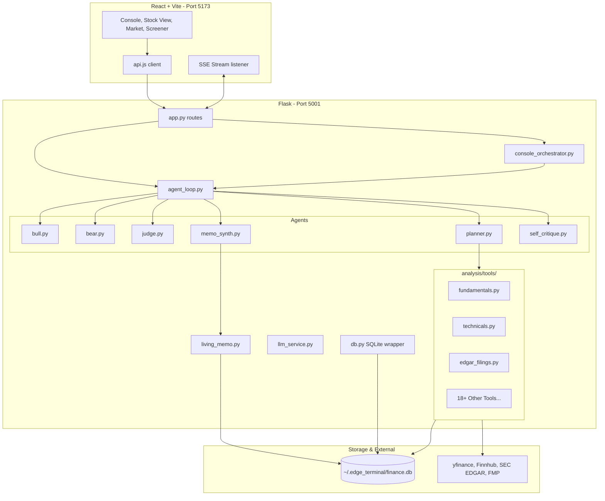

# Edge Personal Markets Terminal (v3)

> A Bloomberg-style, pull-based personal investment terminal combining real-time candlestick charts, technical indicator overlays, multi-agent debate research, saved screeners, and on-demand AI quick takes — built for individual investors who want institutional-grade markets capabilities.

---

## 1. System Architecture

Edge is a pull-based, single-investor market research cockpit. It is designed to be highly reliable, running entirely on a local development setup integrating a Flask backend, a SQLite storage system, and a React + Vite frontend dashboard.



### Key Subsystems
1. **Frontend App (`analysis/web/`)**: Built using React 18 and Vite. Styled with vanilla CSS variables using a dark glassmorphic UI aesthetic. Uses a custom hash-based router (`useHashRoute.js`) to keep dependencies low.
2. **Flask API Core (`analysis/app.py`)**: Runs on port `5001`. Serves REST endpoints for configuration, screens, and charts, and implements SSE streams to emit deep research progress in real-time.
3. **Agent Loop (`analysis/agent_loop.py`)**: Orchestrates the multi-agent research process. Runs the `planner` agent to schedule tools, parses outputs, fires adversarial debates (`bull` vs `bear`), calls the `judge` for verdicts/sizing, critiques reasoning, and triggers the `memo_synth` to stage Living Memo changes.
4. **Tool Registry (`analysis/tools/`)**: Modular, autoloaded plugins subclassing `Tool`. Each tool is citation-aware and returns a `ToolResult` container with explicit confidence levels (`high`, `medium`, or `low`) and API cost calculation.
5. **Database (`analysis/db.py`)**: Manages SQLite connections with WAL (Write-Ahead Logging) enabled.

---

## 2. SQLite Database Schema

The database resides at `~/.edge_terminal/finance.db`. Core tables include:

* **`watchlist`**: Tickers added to the user's primary monitor.
  - Columns: `ticker` (TEXT, PK), `added_at` (DATETIME).
* **`research_reports`**: Archives completed deep research runs.
  - Columns: `id` (INTEGER, PK), `ticker` (TEXT), `verdict` (TEXT, JSON), `bull_case` (TEXT), `bear_case` (TEXT), `budget_usd` (REAL), `cost_usd` (REAL), `created_at` (DATETIME).
* **`living_memo`**: Evolving single-ticker notes.
  - Columns: `ticker` (TEXT, PK), `content` (TEXT), `updated_at` (DATETIME).
* **`living_memo_versions`**: Immutable log of past memo states for auditing.
  - Columns: `id` (INTEGER, PK), `ticker` (TEXT), `version` (INTEGER), `content` (TEXT), `created_at` (DATETIME).
* **`llm_settings`**: Stores chosen providers and model parameters.
  - Columns: `provider` (TEXT, PK), `model_fast` (TEXT), `model_deep` (TEXT), `temperature` (REAL), `api_base_url` (TEXT).
* **`tool_call_log`**: Traces execution of tools during research tasks.
* **`recommendations`**: Tracked performance indicators for stops/targets.
* **`screener_saved`**: Saved rule filters.
* **`themes` & `theme_tickers`**: Cohorts of related tickers for heatmaps and scan grids.

---

## 3. Critical User Journeys (CUJs)

### CUJ 1: Discovery & Pulse Check
1. Open the application. You land on the **Market** page or **Daily Scan**.
2. Clicking "Run Scan" fires a batch request (`POST /api/terminal/snapshot`) compiling quote indicators, top market gainers/losers (Movers), S&P 500 thematic heat, and recent news tape.
3. Observe which stock or theme is displaying unusual activity.

### CUJ 2: Interactive Stock View Inspection
1. Click any ticker in the Market table or watchlist.
2. The page navigates to **Stock View** (`#stock?t=TICKER`), which triggers parallel API queries to load:
   - Candlestick bars + indicators (MA20, MA50, Bollinger Bands, VWAP, RSI, MACD).
   - Core fundamentals, margins, and P/E ratios.
   - Form 4 insider flow and SEC 10-K/10-Q filing links.

### CUJ 3: Server-Sent Agentic Research (Console / Research Form)
1. Navigate to **Console** or **Research**.
2. Run `/thesis AAPL` or click "Research" with `AAPL` selected.
3. The front-end opens a streaming connection (`EventSource` to `/api/research/AAPL/v2/stream`).
4. The backend boots:
   - GICS industry classifications load sector-specific templates (e.g. SaaS, Semis).
   - The **Planner** selects and runs tool batches (financial trends, technicals, transcripts).
   - **Bull** and **Bear** agents debate the setup.
   - The **Judge** recommends a trade plan (conviction level, position sizing, entry zone, stops, targets, and falsifiability guidelines).
   - **Self-Critique** audits claims.
   - **Memo Synth** proposes a staged Living Memo diff.

### CUJ 4: Library Audit & Evolving Memo
1. Open the **Library** page and click the ticker.
2. Inspect the **Living Memo** version history.
3. Track how the narrative changes: green additions denote new observations, while red strike-throughs represent debunked or stale items.

---

## 4. Console Commands

Console command options:
* **`/thesis <T>`**: Runs a normal agentic debate cycle (~$0.60 cost, 4 rounds). Returns bull/bear cases and a Judge trade recommendation.
* **`/dossier <T>`**: Launches a deeper research run (~$2.00 cost) including transcript extraction and extensive peer analytics.
* **`/why <T>`**: Generates a quick 3-sentence on-demand read (~$0.05 cost) using current indicators, cached 4 hours.
* **`/theme <slug>`**: Aggregates constituent indicators and generates a cohesive theme-level investment argument and risk summary.
* **`/compare <A> <B>...`**: Spawns parallel quick deep research runs for up to 5 tickers, generating a comparative score ranking and winner verdict.

---

## 5. Quick Start

### 1. Installation

```bash
# Clone the repository
git clone <repo-url>
cd finance

# Install Python requirements
cd analysis
pip3 install -r requirements.txt

# Install React dependencies
cd web
npm install
```

### 2. Secrets Management
The terminal never stores API keys in SQLite. Export keys in your shell:
```bash
export GOOGLE_API_KEY="your-gemini-key"
export ANTHROPIC_API_KEY="your-claude-key"
export FINNHUB_API_KEY="your-finnhub-key"
```

### 3. Launching
```bash
cd analysis
bash start.sh
```

---

## 6. Testing

### Run Python Tests
```bash
cd analysis
python3 -m pytest tests/
```

### Run Playwright UAT
```bash
cd analysis/web
npm run test:e2e
```

