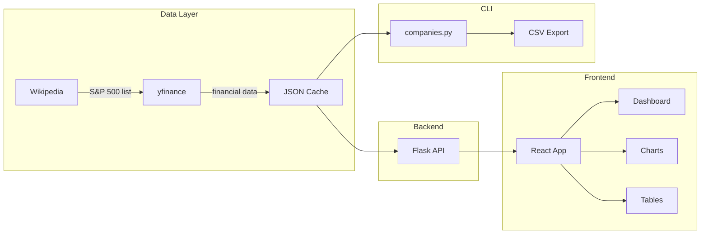

# S&P 500 Company Analysis - Specification

> **Purpose**: Fetch and analyze financial metrics for all S&P 500 companies  
> **Last Updated**: January 2026

## Overview

This project provides both CLI and web-based tools for S&P 500 financial analysis.



---

## Data Sources

| Source | Data Provided | Cost | Rate Limits |
|--------|---------------|------|-------------|
| **Wikipedia** | S&P 500 company list, sectors | Free | None |
| **yfinance** | Prices, P/E, revenue, margins | Free | ~2000 req/hour (unofficial) |

---

## CLI Usage (`companies.py`)

```bash
# Standard run (uses cache if available)
python3 companies.py

# Force fresh data fetch
python3 companies.py --no-cache
```

### Configuration

| Variable | Default | Description |
|----------|---------|-------------|
| `CACHE_DIR` | `.cache/` | Directory for cached data |
| `CACHE_EXPIRY_HOURS` | 12 | Hours before cache expires |
| `MAX_WORKERS` | 5 | Parallel request threads |
| `REQUEST_DELAY` | 0.2s | Delay between API calls |
| `MAX_RETRIES` | 3 | Retry attempts on failure |
| `BACKOFF_FACTOR` | 2 | Exponential backoff multiplier |

### Output Files

- **`sp500_analysis.csv`** - Full metrics export for data analysis
- **`.cache/sp500_data.json`** - Internal cache (12-hour expiry)

---

## Web Application

### Quick Start

```bash
# Terminal 1: Start Flask API
cd /Users/yash/Desktop/Programming/finance/analysis
pip3 install flask flask-cors
python3 app.py

# Terminal 2: Start React dev server
cd /Users/yash/Desktop/Programming/finance/analysis/web
npm install
npm run dev
```

**Access:** http://localhost:5173

### Technology Stack

| Component | Technology |
|-----------|------------|
| Backend | Flask 3.0 + Flask-CORS |
| Frontend | React 18 + Vite |
| Charts | Recharts |
| Styling | Vanilla CSS (dark theme) |

### REST API Endpoints

| Endpoint | Method | Description |
|----------|--------|---------|
| `/api/companies` | GET | All S&P 500 companies (sortable) |
| `/api/sectors` | GET | Sector list with stats |
| `/api/companies/<sector>` | GET | Companies filtered by sector |
| `/api/company/<ticker>` | GET | Single company by ticker symbol |
| `/api/company/<ticker>/history` | GET | 5 years of historical stock prices (cached 4h, `?refresh=true` to bypass cache) |
| `/api/company/<ticker>/financials` | GET | Quarterly/annual revenue/earnings (cached 24h, `?refresh=true` to bypass cache) |
| `/api/spotlight` | GET | Spotlight companies by fundamental analysis heuristics (top 5 per category) |
| `/api/spotlight/<category>` | GET | All companies matching a spotlight category's criteria |
| `/api/patterns/all` | GET | All detected chart patterns across S&P 500 stocks (cached 4h) |
| `/api/patterns/<pattern_type>` | GET | Stocks with specific pattern type (see list below) |
| `/api/patterns/<pattern_type>/<ticker>` | GET | Pattern analysis for a specific stock |
| `/api/patterns/head-shoulders` | GET | Stocks with detected Head & Shoulders reversal patterns (cached 4h) |
| `/api/patterns/head-shoulders/<ticker>` | GET | Pattern analysis for a specific stock |
| `/api/stats` | GET | Summary statistics |
| `/api/search?q=<query>` | GET | Search by ticker/name |
| `/api/refresh` | POST | Trigger fresh data fetch |
| `/api/health` | GET | Health check |

### Frontend Features

- **Spotlight Companies** - Potential buy candidates based on fundamental analysis (click card header to see all):
  - 🚀 Growth Stocks: High revenue growth (>15%) with positive 52-week momentum
  - 🔥 Hot Stocks: Strongest 52-week performance (>20% gains)
  - 💰 Value Plays: Low forward P/E (<15) with expected earnings growth (sorted low→high)
  - 📈 Momentum Leaders: P/E ratio >1.2x indicating earnings acceleration
  - 🏆 Quality Gems: High profit margins (>15%) with solid revenue growth (>5%)
  - 💵 Dividend Champions: High dividend yield (>3%) for income investors
  - 📉 Low Volatility: Stable stocks with beta <0.8 for conservative investors
  - 🏛️ Mega Caps: Largest companies with market cap >$200B
  - 🔄 Turnaround Plays: Down >10% YTD but still profitable (contrarian picks)
  - ⚡ High Beta Movers: High volatility stocks (beta >1.5) for aggressive traders
- **Technical Patterns Dashboard** - Consolidated chart pattern detection:
  - Scans all S&P 500 stocks for 11 pattern types:
    - **Reversal (Bearish)**: Head & Shoulders, Double Top, Triple Top, Descending Triangle
    - **Reversal (Bullish)**: Inverse Head & Shoulders, Double Bottom, Triple Bottom, Falling Wedge
    - **Continuation (Bullish)**: Ascending Triangle, Cup and Handle, Bullish Flag
  - Each pattern shows: confidence score, key price levels, target price
  - Filter by pattern type or signal (bullish/bearish)
  - Click "📊 Technical Patterns" button on main dashboard to access
  - Valid pattern types: `head_shoulders`, `inverse_head_shoulders`, `double_top`, `double_bottom`, `triple_top`, `triple_bottom`, `ascending_triangle`, `descending_triangle`, `cup_and_handle`, `bullish_flag`, `falling_wedge`
- **Dashboard** - Sector overview with market cap and P/E metrics
- **All Companies View** - Browse all 500 companies with full filtering capabilities
- **Company Detail Page** - Click any company to view comprehensive data:
  - Stock price history chart with period selector (1M, 3M, 6M, 1Y, 5Y) - data filtered client-side from single API call
  - **Pattern Visualization** - Full chart visualization for all detected patterns:
    - Supports all 11 pattern types with pattern-specific markers and reference lines
    - Alert banner with pattern name, confidence score, and key price levels (neckline/support/resistance/target)
    - Visual markers on chart: dots for peaks/troughs, lines for support/resistance/target
    - Pattern selector to switch between multiple detected patterns
    - Bullish patterns show green accents; bearish patterns show red/amber accents
    - Dynamic legend explaining pattern elements
  - 52-week high/low range indicator
  - Quarterly financials (revenue, net income by quarter)
  - Annual financials (revenue, net income trends)
  - Clear time period labels: Revenue (TTM), Revenue Growth (YoY)
  - **Refresh Data button** to force fresh data fetch (bypasses cache)
- **Company Table** - Sortable table with financial metrics including:
  - Core metrics: Price, Market Cap, Forward P/E, Trailing P/E, P/E Ratio
  - Profitability: Profit Margin, Revenue Growth
  - **Stock Movement**: Day Change %, 52-Week Change %, % From 52-Week High
  - Ticker symbols link to Yahoo Finance; company names link to detail page
  - Additional data available via API: 52-Week High/Low, 50-Day & 200-Day Moving Averages
- **Filter Panel** - Filter companies by:
  - Sector (dropdown)
  - Forward P/E (min/max range)
  - Trailing P/E (min/max range)
  - P/E Ratio: trailing ÷ forward (>1 = earnings growth expected)
  - Market Cap in billions (min/max range)
  - Profit Margin % (min/max range)
  - Revenue Growth % (min/max range)
  - 52-Week Price Change % (min/max range)
- **Charts** - Pie chart (market cap), bar chart (P/E by sector)
- **Search** - Autocomplete search by ticker or company name
- **Metrics Panel** - Top companies by market cap, lowest P/E, highest growth (all clickable)
- **Force Refresh** - Button to manually trigger fresh data fetch from Yahoo Finance

### Project Structure

```
finance/analysis/
├── app.py              # Flask backend
├── companies.py        # CLI script
├── requirements.txt    # Python dependencies
├── sp500_analysis.csv  # CSV export
├── .cache/             # Data cache
│   └── sp500_data.json
├── web/                # React frontend
│   ├── package.json
│   ├── vite.config.js
│   └── src/
│       ├── App.jsx
│       ├── components/
│       │   ├── Dashboard.jsx
│       │   ├── CompanyTable.jsx
│       │   ├── CompanyDetail.jsx
│       │   ├── SectorChart.jsx
│       │   ├── MetricsPanel.jsx
│       │   ├── SpotlightPanel.jsx      # Spotlight categories overview
│       │   ├── SpotlightDashboard.jsx  # Full category company list
│       │   ├── HeadShouldersDashboard.jsx  # Legacy H&S pattern view
│       │   ├── TechnicalPatternsDashboard.jsx  # Consolidated patterns dashboard
│       │   └── SearchBar.jsx
│       └── utils/
│           └── api.js
└── docs/
    └── spec.md
```

---

## Rate Limiting Strategy

```
1. Add 0.2s base delay between requests
2. Add random jitter (0-0.2s) to avoid thundering herd
3. On failure: exponential backoff (2^attempt seconds)
4. Max 3 retries per ticker
```
