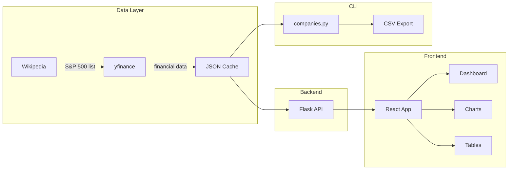

# S&P 500 Company Analysis - Specification

> **Purpose**: Fetch and analyze financial metrics for all S&P 500 companies  
> **Last Updated**: January 2026

## Overview

This project provides both CLI and web-based tools for S&P 500 financial analysis.



---

## Data Sources

| Source | Data Provided | Cost | Rate Limits |
|--------|---------------|------|-------------|
| **Wikipedia** | S&P 500 company list, sectors | Free | None |
| **yfinance** | Prices, P/E, revenue, margins | Free | ~2000 req/hour (unofficial) |

---

## CLI Usage (`companies.py`)

```bash
# Standard run (uses cache if available)
python3 companies.py

# Force fresh data fetch
python3 companies.py --no-cache
```

### Configuration

| Variable | Default | Description |
|----------|---------|-------------|
| `CACHE_DIR` | `.cache/` | Directory for cached data |
| `CACHE_EXPIRY_HOURS` | 12 | Hours before cache expires |
| `MAX_WORKERS` | 5 | Parallel request threads |
| `REQUEST_DELAY` | 0.2s | Delay between API calls |
| `MAX_RETRIES` | 3 | Retry attempts on failure |
| `BACKOFF_FACTOR` | 2 | Exponential backoff multiplier |

### Output Files

- **`sp500_analysis.csv`** - Full metrics export for data analysis
- **`.cache/sp500_data.json`** - Internal cache (12-hour expiry)

---

## Web Application

### Quick Start

```bash
# Terminal 1: Start Flask API
cd /Users/yash/Desktop/Programming/finance/analysis
pip3 install flask flask-cors
python3 app.py

# Terminal 2: Start React dev server
cd /Users/yash/Desktop/Programming/finance/analysis/web
npm install
npm run dev
```

**Access:** http://localhost:5173

### Technology Stack

| Component | Technology |
|-----------|------------|
| Backend | Flask 3.0 + Flask-CORS |
| Frontend | React 18 + Vite |
| Charts | Recharts |
| Styling | Vanilla CSS (dark theme) |

### REST API Endpoints

| Endpoint | Method | Description |
|----------|--------|-------------|
| `/api/companies` | GET | All S&P 500 companies (sortable) |
| `/api/sectors` | GET | Sector list with stats |
| `/api/companies/<sector>` | GET | Companies filtered by sector |
| `/api/stats` | GET | Summary statistics |
| `/api/search?q=<query>` | GET | Search by ticker/name |
| `/api/refresh` | POST | Trigger fresh data fetch |
| `/api/health` | GET | Health check |

### Frontend Features

- **Dashboard** - Sector overview with market cap and P/E metrics
- **All Companies View** - Browse all 500 companies with full filtering capabilities
- **Company Table** - Sortable table with all financial metrics including P/E Ratio (trailing/forward)
- **Filter Panel** - Filter companies by:
  - Sector (dropdown)
  - Forward P/E (min/max range)
  - Trailing P/E (min/max range)
  - P/E Ratio: trailing ÷ forward (>1 = earnings growth expected)
  - Market Cap in billions (min/max range)
  - Profit Margin % (min/max range)
  - Revenue Growth % (min/max range)
- **Charts** - Pie chart (market cap), bar chart (P/E by sector)
- **Search** - Autocomplete search by ticker or company name
- **Metrics Panel** - Top companies by market cap, lowest P/E, highest growth
- **Force Refresh** - Button to manually trigger fresh data fetch from Yahoo Finance

### Project Structure

```
finance/analysis/
├── app.py              # Flask backend
├── companies.py        # CLI script
├── requirements.txt    # Python dependencies
├── sp500_analysis.csv  # CSV export
├── .cache/             # Data cache
│   └── sp500_data.json
├── web/                # React frontend
│   ├── package.json
│   ├── vite.config.js
│   └── src/
│       ├── App.jsx
│       ├── components/
│       │   ├── Dashboard.jsx
│       │   ├── CompanyTable.jsx
│       │   ├── SectorChart.jsx
│       │   ├── MetricsPanel.jsx
│       │   └── SearchBar.jsx
│       └── utils/
│           └── api.js
└── docs/
    └── spec.md
```

---

## Rate Limiting Strategy

```
1. Add 0.2s base delay between requests
2. Add random jitter (0-0.2s) to avoid thundering herd
3. On failure: exponential backoff (2^attempt seconds)
4. Max 3 retries per ticker
```
