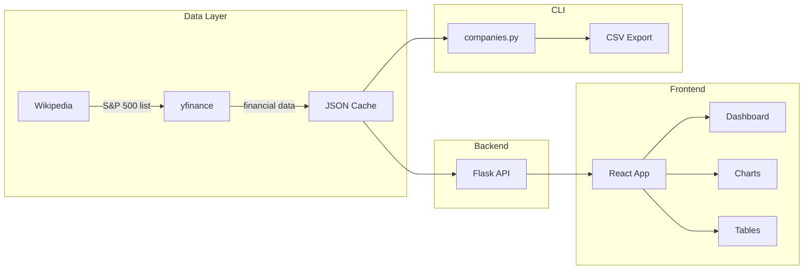

# S&P 500 Company Analysis - Specification

> **Purpose**: Fetch and analyze financial metrics for all S&P 500 companies  
> **Last Updated**: January 2026

## Overview

This project provides both CLI and web-based tools for S&P 500 financial analysis.


```mermaid
flowchart LR
    subgraph Data Layer
        A[Wikipedia] -->|S&P 500 list| B[yfinance]
        B -->|financial data| C[JSON Cache]
    end
    subgraph Backend
        C --> D[Flask API]
    end
    subgraph Frontend
        D --> E[React App]
        E --> F[Dashboard]
        E --> G[Charts]
        E --> H[Tables]
    end
    subgraph CLI
        C --> I[companies.py]
        I --> J[CSV Export]
    end
```

---

## Data Sources

| Source | Data Provided | Cost | Rate Limits |
|--------|---------------|------|-------------|
| **Wikipedia** | S&P 500 company list, sectors | Free | None |
| **yfinance** | Prices, P/E, revenue, margins | Free | ~2000 req/hour (unofficial) |

---

## CLI Usage (`companies.py`)

```bash
# Standard run (uses cache if available)
python3 companies.py

# Force fresh data fetch
python3 companies.py --no-cache
```

### Configuration

| Variable | Default | Description |
|----------|---------|-------------|
| `CACHE_DIR` | `.cache/` | Directory for cached data |
| `CACHE_EXPIRY_HOURS` | 12 | Hours before cache expires |
| `MAX_WORKERS` | 5 | Parallel request threads |
| `REQUEST_DELAY` | 0.2s | Delay between API calls |
| `MAX_RETRIES` | 3 | Retry attempts on failure |
| `BACKOFF_FACTOR` | 2 | Exponential backoff multiplier |

### Output Files

- **`sp500_analysis.csv`** - Full metrics export for data analysis
- **`.cache/sp500_data.json`** - Internal cache (12-hour expiry)

---

## Web Application

### Quick Start

```bash
# Terminal 1: Start Flask API
cd /Users/yash/Desktop/Programming/finance/analysis
pip3 install flask flask-cors
python3 app.py

# Terminal 2: Start React dev server
cd /Users/yash/Desktop/Programming/finance/analysis/web
npm install
npm run dev
```

**Access:** http://localhost:5173

### Technology Stack

| Component | Technology |
|-----------|------------|
| Backend | Flask 3.0 + Flask-CORS |
| Frontend | React 18 + Vite |
| Charts | Recharts |
| Styling | Vanilla CSS (dark theme) |

### REST API Endpoints

| Endpoint | Method | Description |
|----------|--------|---------|
| `/api/market/sp500/companies` | GET | Snapshot-backed S&P 500 companies (sortable) |
| `/api/market/sp500/sectors` | GET | Sector list with stats |
| `/api/market/sp500/companies/<sector>` | GET | Companies filtered by sector |
| `/api/market/sp500/company/<ticker>` | GET | Single company snapshot row by ticker |
| `/api/market/sp500/stats` | GET | Summary statistics and top lists |
| `/api/market/sp500/search?q=<query>` | GET | Search by ticker/name |
| `/api/market/sp500/spotlight` | GET | Spotlight companies by fundamental-analysis heuristics |
| `/api/market/sp500/spotlight/<category>` | GET | All companies matching a spotlight category |
| `/api/market/refresh-sp500` | POST | Pull-triggered S&P 500 snapshot refresh |
| `/api/chart/<ticker>` | GET | OHLCV chart bars via the `price_history` tool |
| `/api/stock/<ticker>/*` | GET | Stock View header/fundamentals/technicals/ownership/filings sections |
| `/api/console/run` | POST | Slash-command SSE stream |
| `/api/health` | GET | Health check |

### Frontend Features

- **Market** - Restored S&P 500 cockpit over the pull-triggered snapshot:
  - Spotlight categories: Growth Stocks, Hot Stocks, Value Plays, Momentum Leaders, Quality Gems, Dividend Champions, Low Volatility, Mega Caps, Turnaround Plays, High Beta Movers
  - Market stats, top-by-market-cap, lowest forward P/E, highest growth
  - Sector cards and charts
  - Search and sortable/filterable all-company table
  - Company clicks open the newer Stock View cockpit
- **Daily Scan** - Movers, Theme Heat, Watchlist, Hypotheses, Catalysts, News Tape, Flow
- **Research** - Form-driven Deep Research stream using the preserved agent loop
- **Console** - Slash-command stream for `/thesis`, `/dossier`, `/why`, `/theme`, `/compare`
- **Dashboard** - Sector overview with market cap and P/E metrics
- **All Companies View** - Browse all 500 companies with full filtering capabilities
- **Comprehensive Smart Filters** - Available across the all-companies and spotlight table views:
  - Advanced Min/Max range inputs for all numeric data (Market Cap, P/E Ratios, Profit Margin, Revenue Growth, Beta, EPS, Div Yield, 52W High/Low, Day Change %, 52W Change %)
  - Dropdown selectors for categorical data (Sector)
  - Dark-themed, dynamic filter panel with "Clear All" functionality
  - All dashboard tables include columns for these comprehensive data points where applicable
- **Company Table** - Sortable table with financial metrics including:
  - Core metrics: Price, Market Cap, Forward P/E, Trailing P/E, P/E Ratio
  - Profitability: Profit Margin, Revenue Growth
  - **Stock Movement**: Day Change %, 52-Week Change %, % From 52-Week High
  - Ticker symbols link to Yahoo Finance; company names open Stock View
  - Additional data available via API: 52-Week High/Low, 50-Day & 200-Day Moving Averages
- **Filter Panel** - Smart filters available on All Companies and Spotlight views:
  - Sector (dropdown)
  - P/E, Forward P/E, Trailing P/E (min/max range)
  - Market Cap in billions (min/max range)
  - Profit Margin % (min/max range)
  - Revenue Growth % (min/max range)
  - EPS, Beta, Div Yield % (min/max range)
  - 52-Week High/Low, 52-Week Price Change %, Day Change % (min/max range)
- **Charts** - Pie chart (market cap), bar chart (P/E by sector)
- **Search** - Autocomplete search by ticker or company name
- **Metrics Panel** - Top companies by market cap, lowest P/E, highest growth (all clickable)
- **Force Refresh** - Button to manually rebuild the S&P 500 snapshot from Yahoo Finance

### Project Structure

```
finance/analysis/
├── app.py              # Flask backend
├── requirements.txt    # Python dependencies
├── .cache/             # Data cache
│   └── sp500_data.json
├── web/                # React frontend
│   ├── package.json
│   ├── vite.config.js
│   └── src/
│       ├── App.jsx
│       ├── components/
│       │   ├── Dashboard.jsx
│       │   ├── CompanyTable.jsx
│       │   ├── SectorChart.jsx
│       │   ├── MetricsPanel.jsx
│       │   ├── SpotlightPanel.jsx      # Spotlight categories overview
│       │   └── SearchBar.jsx
│       ├── pages/
│       │   ├── MarketPage.jsx
│       │   ├── StockViewPage.jsx
│       │   ├── DeepResearchPage.jsx
│       │   └── TerminalPage.jsx
│       └── utils/
│           └── api.js
└── docs/
    └── spec.md
```

---

## Rate Limiting Strategy

```
1. Add 0.2s base delay between requests
2. Add random jitter (0-0.2s) to avoid thundering herd
3. On failure: exponential backoff (2^attempt seconds)
4. Max 3 retries per ticker
```
